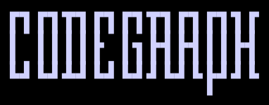

<p align="center">
  
</p>

<p align="center">
  <strong>code knowledge graph for AI agents</strong>
</p>

---

Generates a **code knowledge graph** (multi-language, pluggable connectors) so an agent can navigate the codebase's _relationships_ —what calls what, who uses what, what a change impacts— without grepping everything.

Today it supports **TypeScript / JavaScript** (including JSX/React), resolved with the TS type-checker (`ts-morph`), so calls are **exact**, not guessed by name.

## Requirements

- Node >= 20

## Installation

```bash
npm install -g @ashulab/codegraph
```

Or as a devDependency in a specific repo:

```bash
npm install -D @ashulab/codegraph
```

To develop codegraph itself:

```bash
npm install      # compiles dist/ only (prepare script)
npm test         # runs the tests
npm run build    # recompiles dist/
```

## Use it via MCP (recommended, works in any repo)

The easiest way to give an agent (Claude Code, or any MCP-capable client) the graph
is the built-in MCP server. Install once, globally:

```bash
npm install -g @ashulab/codegraph
codegraph init          # installs the skill + registers the MCP (user-scoped)
```

`init` is idempotent and prints what it does (use `--print` for a dry run). From then
on, in **any repo** you open, the agent has these tools:

| Tool                                     | What it answers                                                                    |
| ---------------------------------------- | ---------------------------------------------------------------------------------- |
| `inspect_symbol(query)`                  | a symbol's location, what it uses, who uses it, **+ its source inline**            |
| `analyze_impact(symbol, depth?)`         | what breaks if you change it (transitive with `depth>1`)                           |
| `trace_path(from, to)`                   | how two symbols connect                                                            |
| `find_dead_code()`                       | dead-code candidates                                                               |
| `survey_repo()`                          | orient on an unfamiliar repo: stats + god nodes + modules                          |
| `search_symbols(query, limit?)`          | semantic search — find symbols by what they **do**, not by name                    |
| `analyze_diff(base?, head?, depth?)`     | what a commit or PR diff actually breaks (maps changed files → impacted symbols)   |
| `open_explorer()`                        | open the **visual** Graph Explorer in the human's browser                          |

The MCP is **multi-repo**: each tool targets the repo you're working in (cwd) and builds
its graph on demand — incrementally, cached under `~/.cache/codegraph/` so your repos
stay clean. The skill tells the agent _when_ to reach for these tools; the tools do the work.

Turn the server **on/off** anytime (the skill stays installed):

```bash
codegraph disable   # unregister the MCP from Claude Code
codegraph enable    # register it again
codegraph status    # is it enabled?
```

To run the server manually (what `init` wires up): `codegraph mcp` (stdio).

## Usage (CLI)

### Generate the graph

```bash
codegraph <source> [--out <dir>]
```

Options:

| Flag                  | Default   | What it does                                                  |
| --------------------- | --------- | ------------------------------------------------------------- |
| `--out <dir>`         | `~/.cache/codegraph/<hash>` | Output folder. Defaults to a per-repo folder under `~/.cache/codegraph/` so the repo stays clean. |
| `--ignore a,b,c`      | —         | Extra dirs to ignore (on top of `node_modules`, `dist`, etc.) |
| `--include-tests`     | off       | Include tests and mocks (excluded by default)                 |
| `--no-cache`          | off       | Force a full rebuild (ignore the incremental cache)           |
| `--top <n>`           | 15        | God nodes to list in the index                                |
| `--with-embeddings`   | off       | Generate semantic embeddings so `search_symbols` / `codegraph query search` work offline without an API key |

`<source>` can be a local path, a GitHub URL, or the `org/repo` shortcut. By default the output goes to `~/.cache/codegraph/<hash>/` (keyed to the repo path) so the repo stays clean — no gitignore needed. Use `--out ./graph` if you want the files in the repo instead. It generates:

- `graph.json` — the full graph (nodes + edges), deterministic and portable (built on demand, not committed).
- `GRAPH_INDEX.md` — a human-readable map for the agent: a `## Snapshot` of stats, God nodes (most connected symbols) + per-module breakdown.
- `graph.html` — the **Graph Explorer**: an interactive, fully offline visualization (Sigma.js/WebGL, no CDN). Starts with the modules overview; click a module to expand its symbols, click a symbol to reveal its neighbors, search to jump anywhere.
- `.codegraph-cache.json` — per-file cache (local only) that makes rebuilds **incremental**.

### Incremental rebuilds

After the first build, re-running reuses a per-file cache and re-extracts only the files whose content changed — plus the files whose edges point into them (so renames/removals stay correct). If nothing changed, no parsing happens at all. Use `--no-cache` to force a clean full build.

```bash
codegraph . --out ./graph
```

### Query the graph

```bash
# What do I break if I modify X? (who calls / uses / extends / implements it)
codegraph query ./graph/graph.json impact <symbol>

# Transitive blast radius: everything affected within N hops
codegraph query ./graph/graph.json impact <symbol> --depth 3

# Neighborhood: what X uses and who uses X
codegraph query ./graph/graph.json neighbors <symbol>

# Shortest path between two symbols
codegraph query ./graph/graph.json path <A> <B>

# Symbols with no dependents in the graph (dead-code candidates)
codegraph query ./graph/graph.json unused

# What does the last commit / a PR diff actually break?
codegraph query ./graph/graph.json diff
codegraph query ./graph/graph.json diff --base main --head HEAD  # branch vs main

# Find symbols by description when you don't know the exact name (needs --with-embeddings)
codegraph query ./graph/graph.json search "rate limiting logic"

# Focused subgraph for a PR (Mermaid)
codegraph mermaid ./graph/graph.json <symbol> --depth 2
```

All queries accept `--json` for parseable output. If a name matches multiple symbols, use the exact id: `path/file.ts::name`.

## Programmatic usage

```ts
import { buildGraph, impact, toIndexMarkdown } from '@ashulab/codegraph';

const { graph } = await buildGraph('.');
const res = impact(graph, 'handleBaseError');
console.log(res.dependents.length);
```

## Integration into an app (module + skill)

For an agent (Claude Code) to use codegraph inside **your app** (e.g. a frontend or service), **two pieces go to different places**:

### 1. The module (the tool) → as a devDependency

In your app's `package.json`:

```jsonc
{
  "devDependencies": {
    "@ashulab/codegraph": "latest",
  },
  "scripts": {
    "graph": "codegraph . --out ./graph",
  },
}
```

### 2. The skill (the agent's judgment) → in `.claude/skills/`

Copy our `skills/codegraph/SKILL.md` into your app:

```
your-app/
  .claude/
    skills/
      codegraph/
        SKILL.md          ← tells the agent when/how to use the graph
  graph/
    graph.json            ← generated by `npm run graph`
    GRAPH_INDEX.md
    graph.html
  package.json
```

### 3. Generate the graph and use it

```bash
npm install      # pulls in codegraph (devDep) and compiles its dist
npm run graph    # generates ./graph/* for the repo itself
```

From there, when you ask the agent "what do I break if I touch X?" or "who renders this component?", the skill guides it to query `./graph/graph.json` instead of grepping.

### What to version

**The generated graph stays out of the repo** — it's a snapshot that goes stale, and it's built on demand (the MCP caches it centrally under `~/.cache/codegraph/`, or you generate it locally to a gitignored folder). Only the **skill** lives with the code.

| File                                  | Commit it?        | Why                                                                      |
| ------------------------------------- | ----------------- | ------------------------------------------------------------------------ |
| `.claude/skills/codegraph/SKILL.md`   | ✅ yes            | the agent's judgment, lives with the repo                                |
| `graph/graph.json` + `GRAPH_INDEX.md` | ❌ no (gitignore) | a snapshot that goes stale; regenerated on demand, not a source of truth |
| `graph/graph.html`                    | ❌ no (gitignore) | the visual view, for viewing by hand, not for the agent                  |
| `graph/.codegraph-cache.json`         | ❌ no (gitignore) | local incremental cache, rebuilt on demand                               |

```gitignore
# your app's .gitignore — the whole generated graph
graph/
```

> The `SKILL.md` already points to `./graph/graph.json` (the default of the `graph` script). If you change `--out`, adjust that path in your copy of the skill.

## How to keep it fresh

The graph is a snapshot of the code at the moment it's generated. A stale graph gives confident but false answers — which is exactly why it isn't committed. The model is **generate on demand**:

- With the **MCP** (recommended), the agent gets a fresh graph automatically: it's built per-repo on first use and kept up to date incrementally, cached under `~/.cache/codegraph/`.
- With the **CLI**, re-run `codegraph . --out ./graph` (incremental, so it's cheap) whenever you want the latest — the agent does this on its own when it detects the graph is stale, to a gitignored path.

## Architecture

- `model/` — the graph, language-agnostic (the contract).
- `connectors/` — one connector per language behind the `Connector` interface. TS uses `ts-morph` in-process.
- `sources/` — source resolution (local / GitHub).
- `outputs/` — json, markdown index, HTML, Mermaid.
- `query/` — impact / neighbors / path.

**Adding a language:** languages with a Node-friendly parser implement the `Connector` interface (in-process). Languages with a native toolchain (e.g. Go with `go/packages`) ship as a separate binary that emits the **same graph JSON schema** — the cross-language contract.

## Edge types

`contains` (file declares symbol) · `imports` (includes re-exports `export … from`) · `calls` · `renders` (component uses another via JSX `<Comp/>`) · `extends` · `implements` · `references` (`new X`, or a function/component passed **by reference** —callback, `onClick={save}` handler—, or an enum used as a value; for exported symbols).
